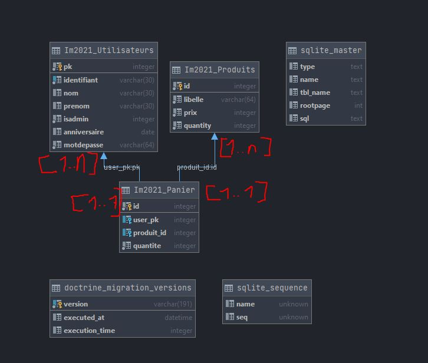

# Projet de Web - Yann Berthelot

## Erratum
&nbsp; Je voudrais commencer ce rapport en m'excusant pour l'absence de binôme sur ce groupe, en effet, avec mon déménagement à Bordeaux et l'organisation de mon stage en Italie dans un timing très serré, j'ai commencé le projet tard (14/04) et l'ai fait le plus rapidement possible sans attendre une réponse tardive des personnes auxquelles j'ai proposé de se joindre à moi. Je m'attend à être sancticonné et le but de cette explication n'est pas de l'éviter, je souhaite juste expliquer la situation car je pense qu'il est toujours préférable de se justifier afin de montrer que ce n'est pas simplement sur un coup de tête que j'ai fait ce projet en monôme malgré la consigne.

## Contexte

Le but de ce projet est de creer un site web de vente permettant de manipuler une base de données sans gestion d'authentification pure. Un paramètre global "id" dans le fichier `config/services.yaml` qui référence la clé primaire de la table utilisateurs sert à la vérification du statut de l'utilisateur connecté.

## Organisation interne

Le schéma de la base de donnée est le suivant : 

&nbsp; Nous avons 2 relations entre l'utilisateur et un panier et un produit eet un panier. Le panier est un peu mal nommé, en effet un `panier` est plus exactement une commande, une ligne de la table référence un utilisateur, un produit et contient la quantité souhaitée. 
Un client commandant 3 articles générera donc 3 lignes dans la table `Panier`. L'avantage des relations mises en place est de pouvoir acceder à n'importe quel champ du produit ou et du client référencé dans la commande, ce qui simplifie grandement la gestion et l'affichage du panier notamment.

La hiérarchie du code, elle, est la suivante : 
